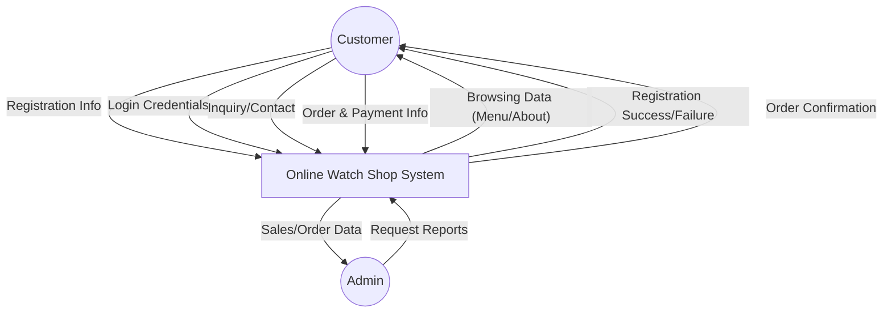
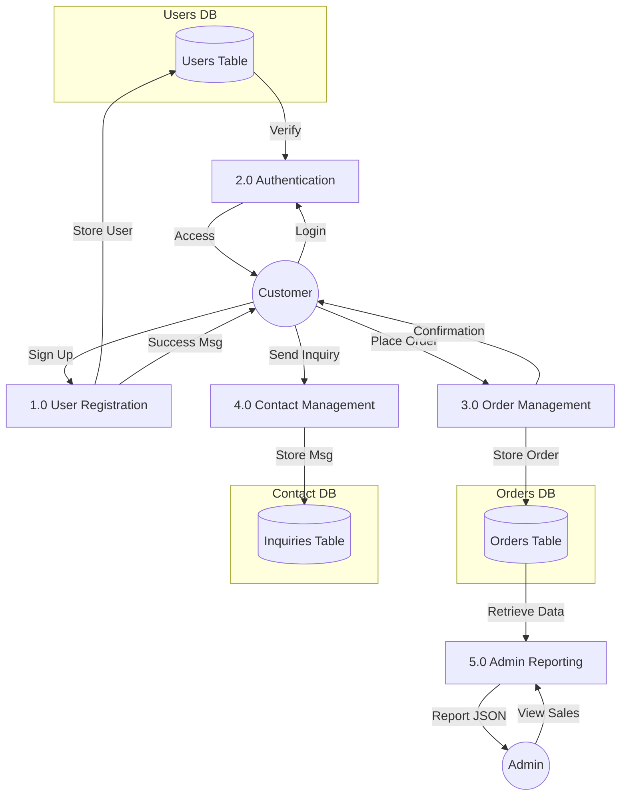
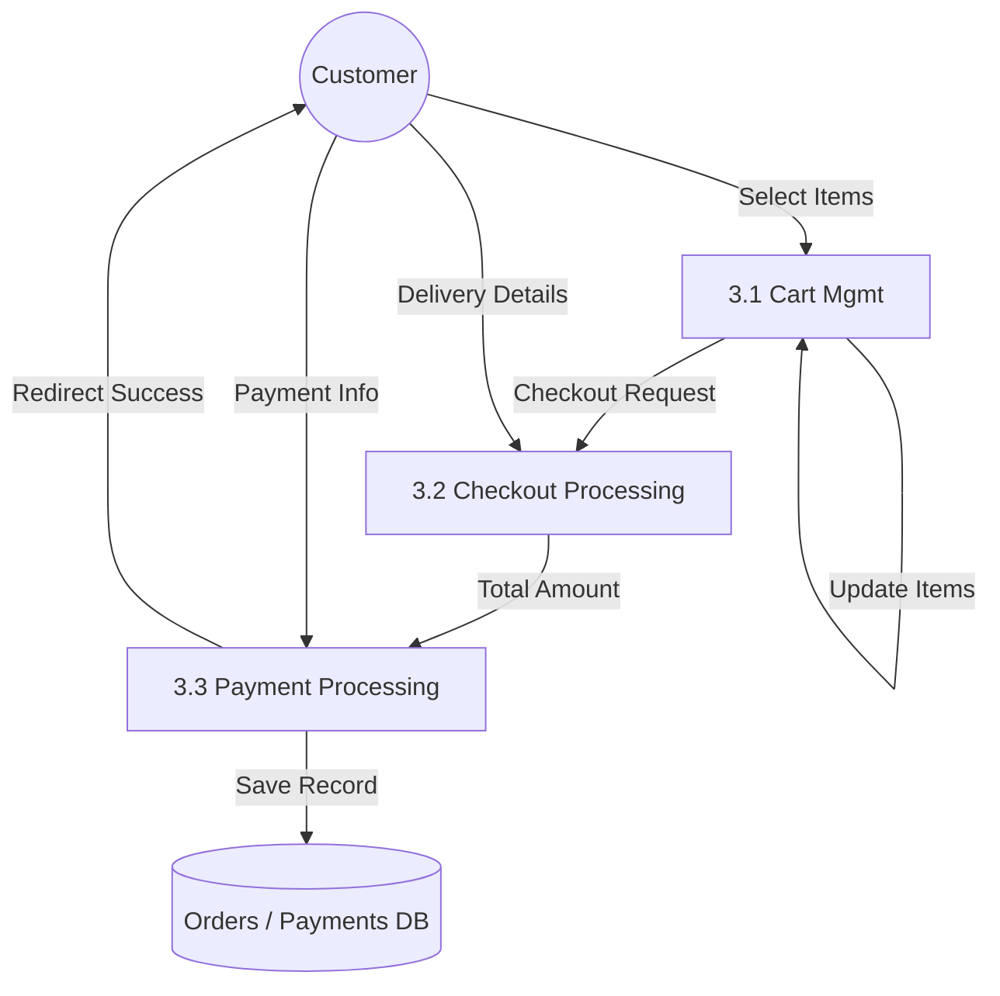

# Data Flow Diagrams (DFD) - Online Watch Shop

This document provides the Level 0, Level 1, and Level 2 DFDs for the Online Watch Shop project, derived from the Java Servlets and MySQL database architecture.

## Level 0: Context Diagram
The Context Diagram shows the system as a single process and its interactions with external entities (Customer and Admin).

[Download Level 0 PNG](0.png)

---

## Level 1: Functional DFD
Level 1 breaks down the system into its primary functional processes.

[Download Level 1 PNG](1.png)

---

## Level 2: Detailed DFD (Order Processing)
Level 2 focuses on the details of the **Order Management (Process 3.0)**, involving Cart, Checkout, and Payment.

[Download Level 2 PNG](2.png)

> [!NOTE]
> These diagrams reflect the logic in [RegistrationServlet.java](file:///d:/online-watch-shop-main/WatchShop/src/java/RegistrationServlet.java), [ProcessOrderServlet.java](file:///d:/online-watch-shop-main/WatchShop/src/java/ProcessOrderServlet.java), [PaymentServlet.java](file:///d:/online-watch-shop-main/WatchShop/src/java/PaymentServlet.java), and [AdminServlet.java](file:///d:/online-watch-shop-main/WatchShop/src/java/AdminServlet/AdminServlet.java).
